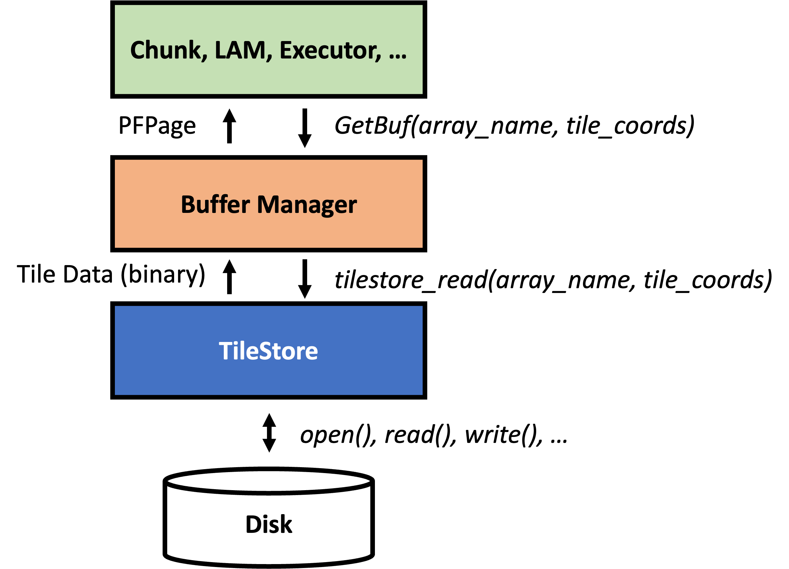
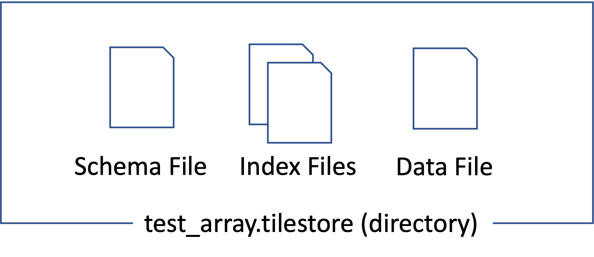
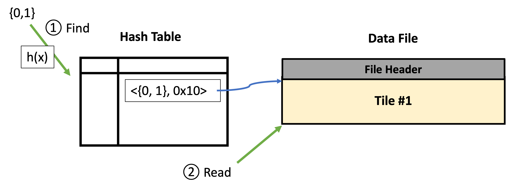
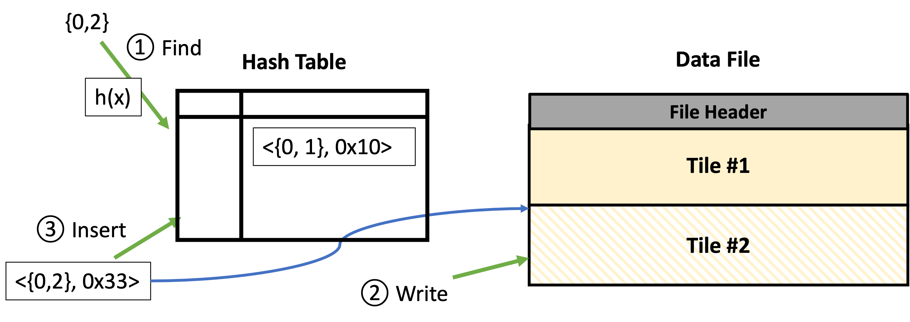
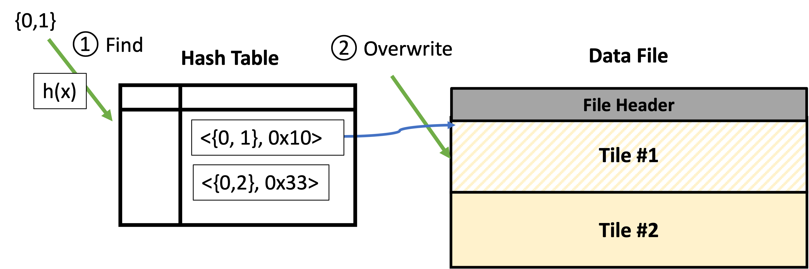

# TileStore: A Storage Engine of TilePACK 

TileStore는 TilePACK의 storage engine 임.
TilePACK에서 사용하던 storage engine인 TileDB의 I/O 성능이 느린 문제가 있어 새로 설계 및 구현하였음.

## Spec

### 관리하는 데이터

TileStore는 Multi-dimensional array data를 관리함. 
하나의 array는 동일한 크기의 Tile로 쪼개져서 관리됨.
하나의 array가 포함하는 각 tile은 dense tile 혹은 sparse tile(support only 2D)임.

각 array는 1개의 attribute만을 포함함. 
여러 attribute를 관리하고 싶다면, 같은 크기의 여러 array를 생성하여 관리하여야 함.

<figure>
    
    <figcaption align="center"><b>TilePACK에서의 TileStore 역할</b></figcaption>
</figure>

### API

TileStore는 이는 상위 layer들의 호환성을 고려하여 tile 단위의 데이터 read 및 write를 지원함.
Array 이름과 읽고자 하는 tile의 좌표값을 입력으로 하여 tile 데이터를 read 혹은 write 할 수 있음(위의 그림 참고).

추가로 array에 대한 스키마 정보 (array size, tile extents 등)와 tile별 메타데이터 (is_sparse, nbytes 등)을 관리함.

두가지 I/O mode를 지원함: Direct I/O (OS의 page cache를 거치치 않음), default (page cache를 거침)

### 데이터 저장 방식

<figure>
    
    <figcaption align="center"><b>TileStore array (array name: test_array)</b></figcaption>
</figure>

하나의 array는 `.tilestore`로 끝나는 디렉토리로 표현된다. 
확장자 앞부분은 array의 이름이다.

각 array 디렉토리는 `schema`, `index`, `data`라는 이름의 3개의 파일을 포함한다.

`schema` 파일은 array의 schema 정보를 담고 있는 파일이다. 
이 파일이 포함하는 데이터는 다음과 같다:
- 현재 버전(`version`)
- 저장하고 있는 attribute의 데이터 타입(`data_type`)
- dimension의 개수(`num_of_dimensions`)
- array의 크기(`array_size`)
- tile 관점에서의 array의 크기(`array_size_in_tile`)
- tile의 크기(`tile_extents`)

`tilestore_get_array_schema()`함수를 호출하면, 위 내용 중 `version`을 제외한 정보들이
    `tilestore_array_schema_t` struct에 담겨 반환된다.

Schema 파일에 포함된 버전(`version`)과 TileStore의 버전(`src/tilestore.c` 내의 `TILESTORE_STORAGE_VERSION`)이 같은 경우에만 해당 array를 사용할 수 있다.
이를 관리하는 이유는, TileStore가 업데이트됨에 따라 데이터를 저장하는 방식이 변경될 수 있기 때문이다.

<figure>
    
    <figcaption align="center"><b>Index and Data File (the entry of hash table is simplified)</b></figcaption>
</figure>

TileStore는 tile의 좌표값을 통하여 tile에 접근하는 인터페이스를 제공한다.
`data`는 각 tile의 데이터가 저장되어 있는 파일이며, 
    `index`는 입력받은 tile 좌표값을 tile 데이터의 위치로 매핑시키는 인덱스를 담고 있다.
인덱스는 hash table로 구현되어 있고, key는 tile의 좌표값을 입력으로 한 hash function의 결과, entry는 각각 tile의 좌표값과 tile의 `data`에서의 offset의 튜플이다.
`data` 파일 안에서 각 tile은 linked list로 표현이 되며, 각 linked list entry는 tile에 대한 메타데이터를 포함한다.

최초로 array가 생성되면, `index` 파일은 빈 hash table만을 포함하고, `data` 파일은 아무런 tile 데이터도 가지고 있지 않는다.
새로운 tile이 입력됨에 따라 `index`파일과 `data`파일은 점점 커지는 형태를 띈다.
TileStore는 새로운 tile에 해당하는 entry를 구성한 뒤 hash table에 삽입한다.
이후 `data`파일의 linked list의 가장 뒤에 새로운 tile에 대한 데이터를 기록한다.

Index File과 관련하여 구현된 File-Based Hashtable은 [Hashtable document](./doc/hashtable/Readme.md)를 참고한다.

Index file에서 관리하는 메타데이터는 다음과 같다:
- Tile 타입(dense tile인지 sparse tile인지 여부)
- Tile 데이터의 크기 (nbytes)
- Tile 데이터의 data file에서의 offset

TileStore는 dense tile과 sparse tile(CSR)을 지원한다. 
유저는 dense tile이냐 sparse tile이냐에 따라 TileStore의 다른 함수를 호출해야 한다.

Data file에 기록되는 정보는 dense tile의 경우 cell의 값들이고, sparse tile의 경우 cell의 값들과 row offsets, column offsets이다.

## Operations

본 섹션에서는 TileStore가 제공하는 API를 통해 find, insert, update 요청을 받았을 때 이를 처리하는 과정에 대하여 설명한다.

### Find

<figure>
    
    <figcaption align="center"><b>Find</b></figcaption>
</figure>

Find 요청을 받으면, TileStore는 Hash Table에서 offset을 구한 뒤 data File에서 read한다.

1. Find an entry that has given coords
2. Read tile data at searched offset with `pread()`

### Insert

<figure>
    
    <figcaption align="center"><b>Insert</b></figcaption>
</figure>

Insert 요청을 받으면, TileStore는 입력받은 tile 데이터를 data file에 append 한 뒤 입력받은 tile의 메타데이터를 Hash Table에 새로운 entry 추가한다.

1. Find an entry that has given coords (to check it is insert or update)
2. Write tile data at the end of the data file with `pwrite()`
3. Insert an entry to the hash table

### Update

<figure>
    
    <figcaption align="center"><b>Update dense tile to dense tile</b></figcaption>
</figure>

Update 요청을 받으면, TileStore는 Hash Table에서 요청받은 tile에 대한 tile metadata를 찾는다.
이후 새로운 데이터의 크기와 기존 데이터의 크기를 비교한다.
만약 새로운 데이터의 크기가 더 크다면, insert와 유사하게 data file의 가장 끝에 새로운 데이터를 기록한다.
이후 offset 등의 tile metadata를 업데이트한다.
만약 새로운 데이터의 크기가 더 작다면, 기존 데이터의 위치에 새로운 데이터를 덮어쓴다. 
이후 tile metadata를 업데이트한다.

이 방식으로 인해 새로운 데이터의 크기가 더 큰 경우와 작은 경우 전부 fragmentation이 발생한다.

## 그 외 기능

### Compaction

#### Darft

Sparse tile을 update 상황에서, 기존의 tile 데이터보다 새로 입력받은 tile 데이터가 더 크다면, insert와 유사한 형태로 새로 입력받은 tile 데이터를 data file의 가장 뒤에 쓴 뒤, 기존의 tile 데이터는 사용하지 않는다고 표시한다.
Sparse tile에 대한 빈번한 update가 발생할 수록 이러한 사용하지 않는 데이터 영역이 커지게 된다.
따라서 TileStore는 이러한 fragmentation을 방지하기 위해 주기적으로 compaction을 수행한다.

TileStore는 아래와 같은 순서로 compaction을 수행한다.

- 모든 tile에 대하여 offset을 두고 `data` 파일을 앞에서부터 iterate하면서 `used=False`인 tile이 발견되면, 그 크기만큼 그 뒤의 tile들의 offset에 추가
- `used=True`인 tile들에 대해 원래 address에서 원래 address에서 offset을 뺀 address로 copy
- 이것들을 hash table에도 반영
